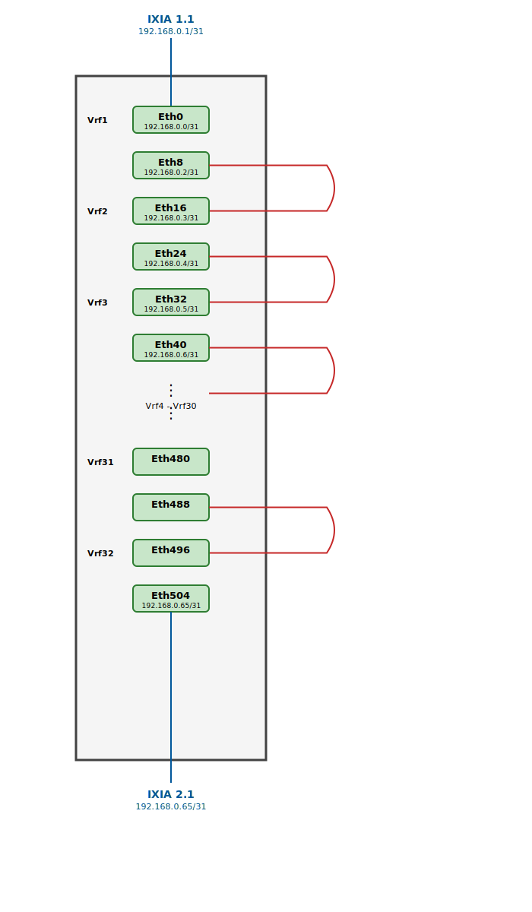

# VRF Snake Configuration Generator for Single DUT

## Overview

The `generate_vrf_snake_1DUT.py` script generates SONiC JSON configuration files for single Device Under Test (DUT) snake topology tests. This configuration creates a loopback routing pattern within a single device using VRFs (Virtual Routing and Forwarding) to isolate traffic flows.

## What is a Snake Test?

A snake test is a network testing topology where traffic flows through multiple interfaces on a device in a serpentine (snake-like) pattern. Traffic enters one interface, gets routed internally through the device, and exits through another interface, which then loops back externally to re-enter the device, creating a continuous flow path.

## Topology

The script generates configurations based on the following architecture:



### Traffic Flow Pattern

- **Flow 1**: 192.168.0.1 → 192.168.0.65 (forward direction)
- **Flow 2**: 192.168.0.65 → 192.168.0.1 (reverse direction)

Traffic enters at **IXIA 1.1** (connected to **Ethernet0**), flows through all 32 VRFs in a snake pattern via external loopback cables, and exits at **IXIA 2.1** (connected to **Ethernet504**).

### External Loopback Connections Required

The snake topology requires external loopback cables connecting the following interface pairs:
- Eth8 ↔ Eth16
- Eth24 ↔ Eth32
- Eth40 ↔ Eth48
- Eth56 ↔ Eth64
- ... (pattern continues for all VRFs)
- Eth472 ↔ Eth480
- Eth488 ↔ Eth496

**Total loopback cables needed**: 30 (one between each consecutive VRF pair)

## Configuration Details

### Default Configuration (Single Flow Mode)

- **VRFs**: 32 VRFs (Vrf1 through Vrf32) - configurable via `--num-interfaces`
- **Interfaces per VRF**: 2 interfaces
- **Total Interfaces**: 64 interfaces (default) - configurable via `--num-interfaces`
- **Interface Naming**: Ethernet0, Ethernet8, Ethernet16, Ethernet24, ...
- **Interface Increment**: 8 (each interface number increases by 8)
- **IP Addressing**: 192.168.0.x/31 (default, configurable)
- **MAC Addressing**: Sequential based on Ethernet number

**Note**: The number of VRFs is automatically calculated as `num_interfaces ÷ interfaces_per_vrf`

### Interface Assignment Pattern

For each VRF (index 0-31):
- **First interface**: Ethernet{vrf_index * 16 + 0}
- **Second interface**: Ethernet{vrf_index * 16 + 8}

Examples:
- Vrf1: Ethernet0, Ethernet8
- Vrf2: Ethernet16, Ethernet24
- Vrf3: Ethernet32, Ethernet40
- Vrf32: Ethernet464, Ethernet504

### Static Routes

The script **dynamically generates** static routes based on the actual interface IP range to enable the snake traffic flow. Route destinations are automatically calculated to avoid conflicts with interface IPs.

**Route Calculation Logic**:
- **Low route**: Points to the minimum interface IP (typically `192.168.0.0/31`)
- **High route**: Calculated as `max_interface_ip + 2` to ensure it's beyond the last interface IP

**Pattern**:
- **Vrf1**: One route (high route) via second interface (Ethernet8)
- **Vrf2+**: Two routes each:
  - Low route (back to start) via first interface
  - High route (forward direction) via second interface

**Examples**:
- **32 interfaces (16 VRFs)**: Routes to `192.168.0.0/31` and `192.168.0.34/31`
- **64 interfaces (32 VRFs)**: Routes to `192.168.0.0/31` and `192.168.0.64/31`
- **128 interfaces (64 VRFs)**: Routes to `192.168.0.0/31` and `192.168.0.130/31`

This dynamic approach ensures static routes never conflict with interface IPs, regardless of the number of interfaces configured.

## Usage

### Basic Usage

```bash
./generate_vrf_snake_1DUT.py --output single_dut_snake.json
```

### Common Options

```bash
# Generate with custom number of interfaces
./generate_vrf_snake_1DUT.py --num-interfaces 128 --output snake_128.json

# Generate with IPv6 addresses
./generate_vrf_snake_1DUT.py --output snake_ipv6.json --include-ipv6

# Use custom base network
./generate_vrf_snake_1DUT.py --base-network 10.0.0 --output custom_snake.json

# Dual flow mode (advanced)
./generate_vrf_snake_1DUT.py --dual-flow --output dual_snake.json

# Custom interfaces with dual flow
./generate_vrf_snake_1DUT.py --num-interfaces 256 --dual-flow --output large_dual.json

# Dry run (preview without creating files)
./generate_vrf_snake_1DUT.py --dry-run
```

### Command-Line Arguments

| Argument | Default | Description |
|----------|---------|-------------|
| `--output` | `single_dut_snake.json` | Output file path |
| `--num-interfaces` | `64` | Total number of interfaces to configure |
| `--base-network` | `192.168.0` | Base IP network for interfaces |
| `--static-route-network` | `192.168` | Static route network base |
| `--base-mac` | `00:00:00:ab:00:00` | Base MAC address |
| `--include-ipv6` | `False` | Include IPv6 addresses (/127) |
| `--dual-flow` | `False` | Generate dual flow configuration (4 interfaces per VRF) |
| `--second-flow-network` | `172.16.0` | Second flow IP network (dual-flow mode) |
| `--dry-run` | `False` | Preview without creating files |

## Output

The script generates a SONiC-compatible JSON configuration file with three main sections:

1. **INTERFACE**: Interface configurations with VRF assignments, IP addresses, and MAC addresses
2. **VRF**: VRF definitions
3. **STATIC_ROUTE**: Static routes for traffic forwarding

### Example Output Structure

```json
{
  "INTERFACE": {
    "Ethernet0": {
      "mac_addr": "00:00:00:ab:00:00",
      "vrf_name": "Vrf1"
    },
    "Ethernet0|192.168.0.0/31": {},
    ...
  },
  "VRF": {
    "Vrf1": {},
    ...
  },
  "STATIC_ROUTE": {
    "Vrf1|192.168.0.64/31": {
      "blackhole": "false",
      "distance": "0",
      "ifname": "Ethernet8",
      "nexthop": "192.168.0.3",
      "nexthop-vrf": "Vrf1"
    },
    ...
  }
}
```

## Scaling Configuration

The script supports flexible scaling through the `--num-interfaces` parameter. The number of VRFs is automatically calculated, and static routes are dynamically generated to prevent IP conflicts.

### Configuration Examples by Scale

| Interfaces | VRFs | Interfaces/VRF | Low Route | High Route | Use Case |
|------------|------|----------------|-----------|------------|----------|
| 16 | 8 | 2 | `192.168.0.0/31` | `192.168.0.18/31` | Small-scale testing |
| 32 | 16 | 2 | `192.168.0.0/31` | `192.168.0.34/31` | Medium-scale testing |
| 64 | 32 | 2 | `192.168.0.0/31` | `192.168.0.64/31` | Standard testing |
| 128 | 64 | 2 | `192.168.0.0/31` | `192.168.0.130/31` | Large-scale testing |
| 128 (dual) | 32 | 4 | `192.168.0.0/31` | `192.168.0.66/31` | Dual-flow testing |

### Why Dynamic Route Calculation?

Earlier versions used hardcoded route destinations (e.g., always `192.168.0.64/31`), which caused IP conflicts when scaling beyond 64 interfaces. The current version:

1. **Scans all interface IPs** to determine the actual IP range used
2. **Calculates low route** as the minimum IP (typically `0`)
3. **Calculates high route** as `max_interface_ip + 2` to ensure it's beyond the last interface
4. **Prevents conflicts** by ensuring route destinations never overlap with interface IPs

This enables seamless scaling from small test configurations to large-scale deployments.

## Use Cases

- **Performance Testing**: Measure throughput and latency across multiple VRFs
- **Scale Testing**: Validate device behavior with any number of VRFs and interfaces
- **VRF Isolation Testing**: Verify traffic isolation between VRFs
- **Routing Validation**: Test static route functionality in VRF context
- **Flexible Testing**: Easily scale tests from small (16 interfaces) to large (256+ interfaces)

## Notes

- External loopback cables are required to connect interface pairs for the snake topology
- The configuration assumes /31 subnets (point-to-point links)
- MAC addresses are automatically generated based on interface numbers
- IPv6 support is optional and uses /127 subnets when enabled
- Static route destinations are dynamically calculated to avoid IP conflicts
- The number of VRFs automatically adjusts based on `--num-interfaces` parameter
- Single flow mode: 2 interfaces per VRF
- Dual flow mode: 4 interfaces per VRF

