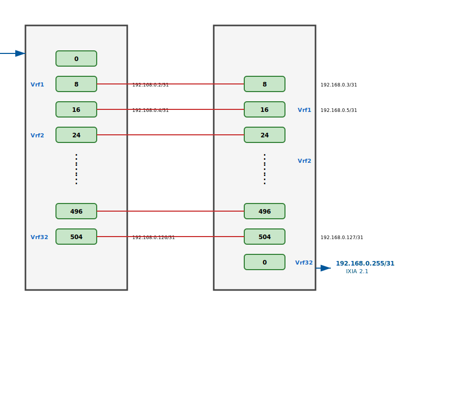

# VRF Snake Configuration Generator for Two DUTs

## Overview

The `generate_vrf_snake_2DUTs.py` script generates SONiC JSON configuration files for a two Device Under Test (DUT) snake topology. This configuration creates a loopback routing pattern across two devices using VRFs (Virtual Routing and Forwarding) to isolate traffic flows and enable bidirectional testing.

## What is a Two-DUT Snake Test?

A two-DUT snake test extends the single-DUT snake topology by distributing the traffic flow across two interconnected devices. Traffic enters one DUT from a traffic generator, flows through multiple VRFs in a serpentine pattern via external loopback cables and cross-device connections, and exits through the second DUT to another traffic generator.

## Topology

The script generates configurations based on the following architecture:



### Traffic Flow Pattern

- **Flow 1**: 192.168.0.1/31 → 192.168.0.255/31 (TG1 → DUT1 → DUT2 → TG2)
- **Flow 2**: 192.168.0.255/31 → 192.168.0.1/31 (TG2 → DUT2 → DUT1 → TG1)

Traffic enters at **IXIA 1.1** (connected to **DUT1 Ethernet0**), flows through all 32 VRFs in a snake pattern via external loopback cables and cross-device links, and exits at **IXIA 2.1** (connected to **DUT2 Ethernet0**).

### Device Configuration

#### DUT1 (vrf-ge101.json)
- **VRF Names**: Vrf1, Vrf2, ..., Vrf32
- **Entry Point**: Ethernet0 (connected to IXIA 1.1 - 192.168.0.1/31)
- **Interfaces**: Ethernet0, Ethernet8, Ethernet16, ..., Ethernet504
- **Cross-device Links**: All even-numbered VRF interfaces connect to DUT2

#### DUT2 (vrf-ge102.json)
- **VRF Names**: Vrf_1, Vrf_2, ..., Vrf_32 (note the underscore)
- **Exit Point**: Ethernet0 (connected to IXIA 2.1 - 192.168.0.255/31)
- **Interfaces**: Ethernet0, Ethernet8, Ethernet16, ..., Ethernet504
- **Cross-device Links**: All interfaces except Ethernet0 connect to DUT1

### External Connections Required

#### Loopback Cables (Within Each DUT)
Each DUT requires internal loopback cables connecting interface pairs within the same VRF:

**DUT1 Loopback Cables** (Vrf1 through Vrf32):
- Vrf1: Eth8 ↔ Eth8 (connects to DUT2)
- Vrf2: Eth16 ↔ Eth24
- Vrf3: Eth32 ↔ Eth40
- ... (pattern continues)
- Vrf32: Eth496 ↔ Eth504

**DUT2 Loopback Cables** (Vrf_1 through Vrf_32):
- Vrf_1: Eth8 ↔ Eth16
- Vrf_2: Eth24 ↔ Eth32
- ... (pattern continues)
- Vrf_32: Eth496 ↔ Eth504 (connects to DUT1)

#### Cross-Device Cables (Between DUT1 and DUT2)
The following cables connect the two DUTs to create the snake path:

- DUT1 Eth8 (Vrf1) ↔ DUT2 Eth8 (Vrf_1) - 192.168.0.2/31 ↔ 192.168.0.3/31
- DUT1 Eth24 (Vrf2) ↔ DUT2 Eth16 (Vrf_1) - 192.168.0.4/31 ↔ 192.168.0.5/31
- DUT1 Eth40 (Vrf3) ↔ DUT2 Eth24 (Vrf_2) - 192.168.0.6/31 ↔ 192.168.0.7/31
- ... (pattern continues)
- DUT1 Eth504 (Vrf32) ↔ DUT2 Eth504 (Vrf_32) - 192.168.0.126/31 ↔ 192.168.0.127/31

**Total cables needed**: 
- Internal loopback cables: ~30 per DUT (60 total)
- Cross-device cables: 32 (one per VRF pair)

## Configuration Details

### Default Configuration

- **VRFs**: 32 VRFs per DUT
- **Interfaces per VRF**: 2 interfaces per DUT
- **Total Interfaces per DUT**: 64 interfaces
- **Interface Naming**: Ethernet0, Ethernet8, Ethernet16, Ethernet24, ... Ethernet504
- **Interface Increment**: 8 (each interface number increases by 8)
- **IP Addressing**: 192.168.0.x/31 (default, configurable)
- **Prefix Length**: /31 for IPv4, /127 for IPv6

### Interface Assignment Pattern

#### DUT1 (Left Side)
For each VRF (index 1-32):
- **First interface**: Ethernet{16 * (vrf_index - 1)}
- **Second interface**: Ethernet{16 * (vrf_index - 1) + 8}

Examples:
- Vrf1: Ethernet0, Ethernet8
- Vrf2: Ethernet16, Ethernet24
- Vrf3: Ethernet32, Ethernet40
- Vrf32: Ethernet496, Ethernet504

#### DUT2 (Right Side)
For VRF 1 through 31:
- **First interface**: Ethernet{8 + 16 * (vrf_index - 1)}
- **Second interface**: Ethernet{8 + 16 * (vrf_index - 1) + 8}

For VRF 32 (special case):
- **First interface**: Ethernet0 (TG2 connection)
- **Second interface**: Ethernet504 (cross-link to DUT1)

Examples:
- Vrf_1: Ethernet8, Ethernet16
- Vrf_2: Ethernet24, Ethernet32
- Vrf_31: Ethernet488, Ethernet496
- Vrf_32: Ethernet0, Ethernet504

### IP Addressing Scheme

- **TG1 ↔ DUT1**: 192.168.0.0/31 (DUT1 = .0, TG1 = .1)
- **DUT1 ↔ DUT2 Links**: Start at 192.168.0.2/31, increment by 2 for each link
  - DUT1 gets even addresses (.2, .4, .6, ...)
  - DUT2 gets odd addresses (.3, .5, .7, ...)
- **TG2 ↔ DUT2**: 192.168.0.254/31 (DUT2 = .254, TG2 = .255)

### Static Routes

#### DUT1 Static Routes
- **Vrf1**: Route to TG2 network (192.168.0.254/31) via Ethernet8
- **Vrf2-Vrf32**: Two routes each:
  - Route to TG1 network (192.168.0.0/31) via first interface
  - Route to TG2 network (192.168.0.254/31) via second interface

#### DUT2 Static Routes
- **Vrf_1 through Vrf_31**: Two routes each:
  - Route to TG1 network (192.168.0.0/31) via first interface
  - Route to TG2 network (192.168.0.254/31) via second interface
- **Vrf_32**: Route to TG1 network (192.168.0.0/31) via Ethernet504 only

## Usage

### Basic Usage

```bash
# Generate default IPv4 configuration
./generate_vrf_snake_2DUTs.py

# This creates:
# - vrf-ge101.json (DUT1 configuration)
# - vrf-ge102.json (DUT2 configuration)
```

### IPv6 Configuration

```bash
# Generate IPv6 configuration
./generate_vrf_snake_2DUTs.py --family v6

# With custom IPv6 addresses
./generate_vrf_snake_2DUTs.py --family v6 \
  --tg1-ip "2001:db8::1" \
  --tg2-ip "2001:db8::fe" \
  --interconnect-start "2001:db8::2"
```

### Custom Configuration

```bash
# Custom number of VRFs
./generate_vrf_snake_2DUTs.py --num-vrfs 16

# Custom output files
./generate_vrf_snake_2DUTs.py --left-out dut1_config.json --right-out dut2_config.json

# Custom IPv4 addressing
./generate_vrf_snake_2DUTs.py \
  --tg1-ip "10.0.0.0" \
  --tg2-ip "10.0.0.254" \
  --interconnect-start "10.0.0.2"
```

### Command-Line Arguments

| Argument | Default | Description |
|----------|---------|-------------|
| `--family` | `v4` | IP family: `v4` or `v6` |
| `--num-vrfs` | `32` | Number of VRFs to configure |
| `--tg1-ip` | `192.168.0.0` (v4)<br>`2001:db8::` (v6) | DUT1 IP address towards TG1 |
| `--tg2-ip` | `192.168.0.254` (v4)<br>`2001:db8::fe` (v6) | DUT2 IP address towards TG2 |
| `--interconnect-start` | `192.168.0.2` (v4)<br>`2001:db8::2` (v6) | First DUT1-DUT2 interconnect IP |
| `--v4-prefixlen` | `31` | IPv4 prefix length |
| `--v6-prefixlen` | `127` | IPv6 prefix length |
| `--left-out` | `vrf-ge101.json` | DUT1 output file |
| `--right-out` | `vrf-ge102.json` | DUT2 output file |

## Output Files

The script generates two SONiC-compatible JSON configuration files:

### vrf-ge101.json (DUT1)
Contains three main sections:
1. **INTERFACE**: Interface configurations with VRF assignments and IP addresses
2. **VRF**: VRF definitions (Vrf1 through Vrf32)
3. **STATIC_ROUTE**: Static routes for traffic forwarding

### vrf-ge102.json (DUT2)
Contains three main sections:
1. **INTERFACE**: Interface configurations with VRF assignments and IP addresses
2. **VRF**: VRF definitions (Vrf_1 through Vrf_32)
3. **STATIC_ROUTE**: Static routes for traffic forwarding

### Example Output Structure (DUT1)

```json
{
  "INTERFACE": {
    "Ethernet0": {
      "vrf_name": "Vrf1"
    },
    "Ethernet0|192.168.0.0/31": {},
    "Ethernet8": {
      "vrf_name": "Vrf1"
    },
    "Ethernet8|192.168.0.2/31": {},
    ...
  },
  "VRF": {
    "Vrf1": {},
    "Vrf2": {},
    ...
  },
  "STATIC_ROUTE": {
    "Vrf1|192.168.0.254/31": {
      "blackhole": "false",
      "distance": "0",
      "ifname": "Ethernet8",
      "nexthop": "192.168.0.3",
      "nexthop-vrf": "Vrf1"
    },
    ...
  }
}
```

## Use Cases

- **Multi-DUT Performance Testing**: Measure throughput and latency across two devices
- **Cross-Device VRF Testing**: Validate VRF functionality across device boundaries
- **Scale Testing**: Test 32 VRFs and 64 interfaces per device simultaneously
- **Bidirectional Traffic Testing**: Verify symmetric and asymmetric traffic flows
- **Inter-Device Routing**: Test static route functionality across VRF boundaries
- **High-Availability Testing**: Simulate redundant path scenarios

## Deployment Steps

1. **Generate Configuration Files**:
   ```bash
   ./generate_vrf_snake_2DUTs.py
   ```

2. **Apply Configuration to DUT1**:
   ```bash
   sonic-cfggen -j vrf-ge101.json --write-to-db
   ```

3. **Apply Configuration to DUT2**:
   ```bash
   sonic-cfggen -j vrf-ge102.json --write-to-db
   ```

4. **Connect Physical Cables**:
   - Connect internal loopback cables on each DUT
   - Connect cross-device cables between DUT1 and DUT2
   - Connect IXIA 1.1 to DUT1 Ethernet0
   - Connect IXIA 2.1 to DUT2 Ethernet0

5. **Verify Configuration**:
   ```bash
   # On each DUT
   show vrf
   show ip interface
   show ip route vrf all
   ```

6. **Start Traffic Testing**:
   - Configure IXIA 1.1 with source IP 192.168.0.1
   - Configure IXIA 2.1 with source IP 192.168.0.255
   - Start bidirectional traffic flows

## Notes

- VRF naming differs between DUTs: DUT1 uses `VrfN`, DUT2 uses `Vrf_N`
- External cables are required for both internal loopbacks and cross-device connections
- The configuration assumes /31 subnets (point-to-point links) for IPv4
- IPv6 support uses /127 subnets when enabled
- Each VRF maintains traffic isolation while allowing controlled inter-VRF routing via static routes
- The last VRF (Vrf32/Vrf_32) has special routing to connect to the second traffic generator

## Troubleshooting

### Traffic Not Flowing
- Verify all physical cables are connected correctly
- Check VRF assignments: `show vrf`
- Verify IP addresses: `show ip interface`
- Check static routes: `show ip route vrf <vrf_name>`

### Incorrect Routing
- Verify nexthop addresses match peer interface IPs
- Check that nexthop-vrf matches the interface's VRF
- Ensure static routes are installed: `show ip route vrf all static`

### Configuration Errors
- Validate JSON syntax before applying
- Check for duplicate IP addresses
- Verify interface names match physical ports
