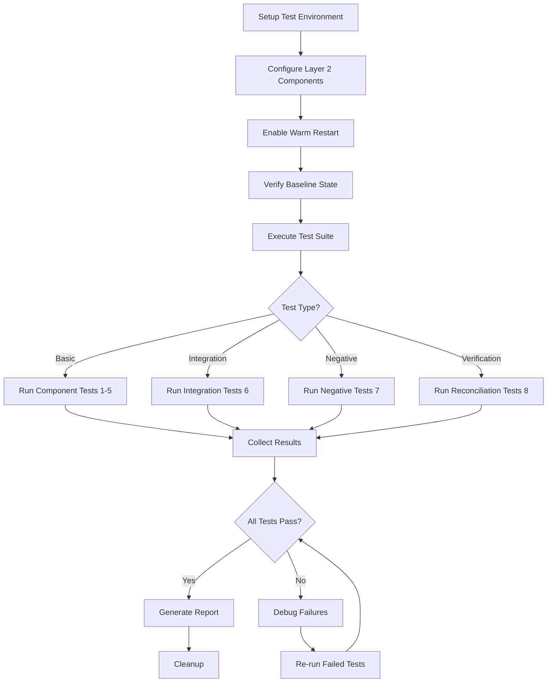

# Warm Reboot Layer 2 Test Plan - Summary

## Quick Reference

### Components Under Test
Based on the WARM_RESTART_TABLE entries (excluding vxlanmgrd as "not priority"):

| Component | Purpose | Priority |
|-----------|---------|----------|
| vlanmgrd | VLAN management | HIGH |
| fdbsyncd | FDB synchronization | HIGH |
| teamsyncd | LAG/PortChannel sync | HIGH |
| teammgrd | LAG/PortChannel management | HIGH |
| portsyncd | Port synchronization | HIGH |
| intfmgrd | Interface management | MEDIUM |

### Test Categories Overview

```
Layer 2 Warm Reboot Tests
├── 1. VLAN Tests (vlanmgrd)
│   ├── 1.1 VLAN Configuration Persistence
│   ├── 1.2 VLAN Interface State Preservation
│   └── 1.3 VLAN Member Port Tagging Mode
│
├── 2. FDB Tests (fdbsyncd)
│   ├── 2.1 MAC Address Learning Persistence
│   ├── 2.2 Static MAC Entries Preservation
│   └── 2.3 FDB Aging During Warm Reboot
│
├── 3. LAG/PortChannel Tests (teamsyncd, teammgrd)
│   ├── 3.1 PortChannel Configuration Persistence
│   ├── 3.2 LACP State Preservation
│   ├── 3.3 PortChannel Member Link Failure During Warm Reboot
│   └── 3.4 PortChannel Min-Links Configuration
│
├── 4. Port Synchronization Tests (portsyncd)
│   ├── 4.1 Port State Preservation
│   └── 4.2 Port Configuration Preservation
│
├── 5. Interface Management Tests (intfmgrd)
│   └── 5.1 Interface Configuration Persistence
│
├── 6. Integration Tests (Multi-Component)
│   ├── 6.1 VLAN with PortChannel Members
│   ├── 6.2 Multiple VLANs with Overlapping PortChannel Members
│   └── 6.3 Layer 2 Forwarding During Warm Reboot
│
├── 7. Negative Tests
│   ├── 7.1 Warm Reboot with Component Failure
│   ├── 7.2 Configuration Change During Warm Reboot
│   ├── 7.3 Warm Reboot Timeout
│   └── 7.4 Repeated Warm Reboots
│
└── 8. Reconciliation and State Verification Tests
    ├── 8.1 Component Reconciliation State Tracking
    ├── 8.2 Database Consistency Verification
    └── 8.3 Restore Count Verification
```

### Total Test Count: 20 Tests

## Key Validation Points

### Database Tables to Monitor
- **CONFIG_DB (DB 4)**: Configuration persistence
  - VLAN|*
  - VLAN_MEMBER|*
  - PORTCHANNEL|*
  - PORTCHANNEL_MEMBER|*
  - PORT|*

- **APPL_DB (DB 0)**: Application state
  - LAG_TABLE
  - LAG_MEMBER_TABLE
  - FDB_TABLE

- **ASIC_DB (DB 1)**: Hardware state
  - ASIC_STATE:SAI_OBJECT_TYPE_FDB_ENTRY:*

- **STATE_DB (DB 6)**: Operational state
  - WARM_RESTART_TABLE|*
  - WARM_RESTART_ENABLE_TABLE|*

### Critical Success Metrics

| Metric | Target | Critical? |
|--------|--------|-----------|
| Configuration Loss | 0% | YES |
| Packet Loss | < 1% | YES |
| Reconciliation Time | < 5 min | YES |
| FDB Preservation | > 95% | YES |
| LACP Re-negotiation | None | YES |
| Reboot Duration | < 90 sec | NO |
| Latency Spike | < 100ms | NO |

## Test Execution Workflow



## Quick Start Commands

### Setup
```bash
# Enable warm restart
config warm_restart enable system
config warm_restart enable swss
config warm_restart enable teamd

# Create test VLANs
config vlan add 100
config vlan add 200
config vlan member add 100 Ethernet0 -u
config vlan member add 200 Ethernet4 -t

# Create test PortChannels
config portchannel add PortChannel0001
config portchannel member add PortChannel0001 Ethernet8
```

### Execute Warm Reboot
```bash
# Initiate warm reboot
warm-reboot

# Monitor reconciliation (in separate session)
watch -n 1 'redis-cli -n 6 keys "WARM_RESTART_TABLE|*" | xargs -I {} redis-cli -n 6 hget {} state'
```

### Verification
```bash
# Check component states
redis-cli -n 6 hget "WARM_RESTART_TABLE|vlanmgrd" state
redis-cli -n 6 hget "WARM_RESTART_TABLE|fdbsyncd" state
redis-cli -n 6 hget "WARM_RESTART_TABLE|teamsyncd" state

# Verify configuration
show vlan brief
show interfaces portchannel
show mac
```

## Test Priority Matrix

| Test ID | Priority | Complexity | Duration | Dependencies |
|---------|----------|------------|----------|--------------|
| 1.1 | P0 | Low | 5 min | None |
| 1.2 | P1 | Low | 5 min | 1.1 |
| 1.3 | P1 | Medium | 10 min | 1.1 |
| 2.1 | P0 | Medium | 10 min | None |
| 2.2 | P1 | Low | 5 min | 2.1 |
| 2.3 | P2 | Medium | 15 min | 2.1 |
| 3.1 | P0 | Medium | 10 min | None |
| 3.2 | P0 | High | 15 min | 3.1 |
| 3.3 | P1 | High | 20 min | 3.1 |
| 3.4 | P2 | Medium | 10 min | 3.1 |
| 4.1 | P1 | Low | 5 min | None |
| 4.2 | P1 | Low | 5 min | 4.1 |
| 5.1 | P2 | Low | 5 min | None |
| 6.1 | P0 | High | 20 min | 1.1, 3.1 |
| 6.2 | P1 | High | 25 min | 1.1, 3.1 |
| 6.3 | P0 | High | 30 min | All basic |
| 7.1 | P1 | High | 15 min | None |
| 7.2 | P2 | Medium | 10 min | None |
| 7.3 | P2 | Medium | 15 min | None |
| 7.4 | P1 | Medium | 60 min | All basic |
| 8.1 | P0 | Medium | 10 min | None |
| 8.2 | P0 | High | 15 min | None |
| 8.3 | P1 | Low | 5 min | None |

**Priority Levels:**
- P0: Must pass for release
- P1: Should pass for release
- P2: Nice to have

## Estimated Test Execution Time
- **Basic Tests (1-5)**: ~2 hours
- **Integration Tests (6)**: ~1.5 hours
- **Negative Tests (7)**: ~2 hours
- **Verification Tests (8)**: ~30 minutes
- **Total**: ~6 hours (sequential execution)
- **With Parallelization**: ~3-4 hours

---
**For detailed test procedures, see**: `warm_reboot_layer2_test_plan.md`

